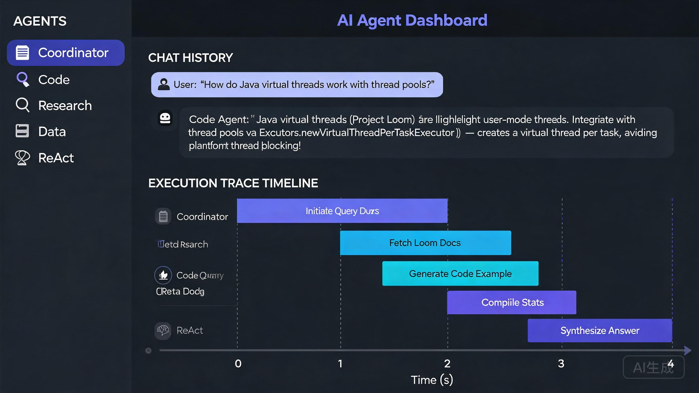

<div align="center">

# AI Agent

**基于 Spring AI + DeepSeek 构建的多 Agent 智能体平台**
*Multi-Agent platform built on Spring AI + DeepSeek*

[](https://github.com/baiyu-jujuc/ai-agent/actions/workflows/ci.yml)
[](LICENSE)
[](https://openjdk.org/)
[](https://spring.io/projects/spring-boot)
[](https://spring.io/projects/spring-ai)

</div>

<div align="center">



</div>

---

## 项目亮点 / Highlights

- **路由式多 Agent 编排** — Coordinator 按意图路由到专家 Agent，支持顺序/并行编排策略，执行轨迹可追溯
- **Function Calling** — 基于 Spring AI 原生 `@Tool` 注解，7 个内置工具自动注册，LLM 自主调用
- **RAG 检索增强** — 文档分块索引（500 字符 / 100 重叠），支持 TXT / Markdown / PDF，中文单字分词
- **安全边界** — API Key 鉴权、按 IP 限流、CORS 白名单、文件沙箱、SSRF 防护，五层防护
- **可切换存储后端** — Dev 模式零依赖（InMemory），Prod 模式一键切换 Qdrant + Redis
- **全链路可观测** — 75 个自动化测试、SSE 流式输出、执行轨迹可视化、Actuator 健康检查

---

## 架构说明 / Architecture

```
                         ┌──────────────┐
                         │   Web UI     │  index.html (SSE streaming)
                         └──────┬───────┘
                                │
                    ┌───────────▼───────────┐
                    │    ChatController      │  REST API + SSE
                    │  /simple /stream      │  /orchestrate /agent
                    └───┬───────┬───────┬───┘
                        │       │       │
           ┌────────────▼─┐  ┌──▼──┐  ┌─▼──────────────┐
           │CoordinatorAgent│ │ RAG │  │Orchestrator    │
           │ (intent route) │ └─────┘  │ sequential/    │
           └──┬──┬──┬──┬───┘          │ parallel      │
      ┌───────▼──▼──▼──▼───────┐      └───────┬───────┘
      │  Expert Agents         │              │
      │  Code / Research /     │──────tools───┘
      │  Data / ReAct           │
      └───────────┬─────────────┘
                  │
         ┌────────▼────────┐
         │  ToolRegistry   │  @Tool annotations → auto-discovered
         │  7 built-in tools│
         └────────┬────────┘
                  │
    ┌─────────────▼──────────────┐
    │   ChatMemoryService        │  InMemory / Redis
    │   token budget + eviction   │  session-level LRU
    └─────────────────────────────┘
```

**核心组件职责：**

| 组件 | 职责 |
|------|------|
| `CoordinatorAgent` | LLM 意图分类 → 路由到专家 Agent，关键词兜底 |
| `CodeAgent` / `ResearchAgent` / `DataAgent` | 专家 Agent，不同 system prompt + 工具子集 |
| `ReActAgent` | ReAct 推理循环，挂载全部工具 |
| `OrchestrationStrategy` | 顺序/并行编排，带 `TaskTrace` 执行轨迹 |
| `ToolRegistry` | 统一扫描 `@Tool` 注解，供 Function Calling 与直接执行共用 |
| `RagService` | 文档分块索引 + 检索增强生成 |
| `ChatMemoryService` | InMemory/Redis 双后端，token 预算 + 消息条数 + 会话淘汰 |
| `SecurityConfig` | API Key 鉴权 + 限流 + CORS + 文件沙箱 + SSRF 防护 |

---

## 功能清单 / Features

| 功能 | 状态 | 说明 |
|------|------|------|
| 多 Agent 系统 | ✅ | Coordinator / Code / Research / Data / ReAct |
| 多 Agent 编排 | ✅ | 顺序 + 并行策略，执行轨迹可追溯 |
| Function Calling | ✅ | Spring AI 原生 `@Tool`，7 个内置工具 |
| RAG | ✅ | TXT / Markdown / PDF，中文单字分词，500 字符分块 |
| SSE 流式输出 | ✅ | 支持指定 Agent 与工具调用 |
| 对话记忆 | ✅ | token 预算 + 消息条数 + 会话级淘汰 (InMemory/Redis) |
| 存储后端切换 | ✅ | Dev: InMemory (零依赖) / Prod: Qdrant + Redis |
| API Key 鉴权 | ✅ | 常量时间比较，请求头传递 |
| 限流 | ✅ | 按 IP 每分钟限制，超出 429 |
| CORS 白名单 | ✅ | 可配置允许来源 |
| 文件沙箱 | ✅ | 限制在 workspace/ 目录，路径穿越防护 |
| SSRF 防护 | ✅ | 禁止内网 / 元数据地址 |
| Qdrant 向量存储 | ⚠️ 实验性 | 需独立 embedding 服务，DeepSeek 不提供 embedding |
| H2 数据库 | ℹ️ 仅声明 | 无业务持久化，开发阶段未使用 |

---

## 技术栈 / Tech Stack

| 组件 | 选型 |
|------|------|
| 框架 | Spring Boot 3.4 + Spring AI 1.0 |
| LLM | DeepSeek V4 (OpenAI 兼容端点) |
| 向量存储 | InMemory 关键词匹配 (开发) / Qdrant (实验性) |
| 对话记忆 | InMemory (开发) / Redis (生产) |
| 流式输出 | SSE (Server-Sent Events) |
| 构建 | Maven 3.9 + Maven Wrapper |
| Java | JDK 21 |
| 测试 | JUnit 5 + Mockito + MockMvc |

---

## 快速开始 / Quick Start

### 1. 配置环境变量

```bash
cp .env.example .env
# 编辑 .env，填入 DeepSeek API Key
# DEEPSEEK_API_KEY=sk-your-api-key-here
```

### 2. 编译并运行

```bash
# 编译
./mvnw clean compile

# 开发模式 (InMemory 存储, 无需 Docker)
./mvnw spring-boot:run

# 生产模式 (Qdrant + Redis, 需先启动 Docker)
$env:VECTOR_STORE_TYPE="qdrant"; $env:MEMORY_TYPE="redis"; ./mvnw spring-boot:run
```

### 3. 访问

| 地址 | 说明 |
|------|------|
| http://localhost:8080 | Web UI |
| http://localhost:8080/api/chat/simple | 聊天 API |
| http://localhost:8080/api/chat/models | 模型列表 |
| http://localhost:8080/api/chat/tools | 工具列表 |
| http://localhost:8080/api/chat/storage-status | 存储状态 |
| http://localhost:8080/actuator/health | 健康检查 |

---

## API 示例 / API Examples

> 除少数只读 GET 接口外，所有接口都需在请求头携带 `X-API-Key`。

```bash
export AGENT_API_KEY=dev-key-change-in-production
```

### 简单对话
```bash
curl -X POST http://localhost:8080/api/chat/simple \
  -H "Content-Type: application/json" \
  -H "X-API-Key: $AGENT_API_KEY" \
  -d '{"message": "你好", "model": "deepseek-v4-flash"}'
```

### 带工具调用的对话
```bash
curl -X POST http://localhost:8080/api/chat/simple \
  -H "Content-Type: application/json" \
  -H "X-API-Key: $AGENT_API_KEY" \
  -d '{"message": "2+3*4 等于多少？", "useTools": "true"}'
```

### 多 Agent 编排（含执行轨迹）
```bash
curl -X POST http://localhost:8080/api/chat/orchestrate \
  -H "Content-Type: application/json" \
  -H "X-API-Key: $AGENT_API_KEY" \
  -d '{"message": "研究 Java 虚拟线程的适用场景", "strategy": "sequential", "agents": ["research", "code"]}'
```

### 执行工具
```bash
curl -X POST http://localhost:8080/api/tools/calculator \
  -H "Content-Type: application/json" \
  -H "X-API-Key: $AGENT_API_KEY" \
  -d '{"input": "2+3*4"}'
```

---

## 可用模型 / Models

| 模型 | 用途 | 特点 |
|------|------|------|
| `deepseek-v4-flash` | 默认 | 快速响应，低成本 |
| `deepseek-v4-pro` | 复杂任务 | 最强推理能力 |
| `deepseek-v4-flash-vision-exp` | 图像输入 | 支持图片理解 (实验) |

---

## 环境变量 / Environment Variables

| 变量 | 默认值 | 说明 |
|------|--------|------|
| `DEEPSEEK_API_KEY` | **必填** | DeepSeek API Key |
| `AGENT_API_KEY` | `dev-key-change-in-production` | 本服务 API Key |
| `FILE_ACCESS_DIR` | `./workspace` | 文件工具沙箱根目录 |
| `RATE_LIMIT` | `30` | 单客户端每分钟请求上限 |
| `ALLOWED_ORIGINS` | `localhost:8080,3000` | CORS 允许来源 |
| `VECTOR_STORE_TYPE` | `memory` | `memory` (开发) / `qdrant` (生产) |
| `MEMORY_TYPE` | `memory` | `memory` (开发) / `redis` (生产) |
| `MEMORY_MAX_TOKENS` | `8000` | 单会话 token 预算 |
| `MEMORY_MAX_MESSAGES` | `40` | 单会话消息条数上限 |
| `MAX_CONVERSATIONS` | `100` | 最大会话数，超出 LRU 淘汰 |
| `QDRANT_HOST` | `localhost` | Qdrant 地址 |
| `QDRANT_PORT` | `6333` | Qdrant 端口 |
| `QDRANT_INIT_SCHEMA` | `false` | 首次启动自动创建 collection |
| `REDIS_HOST` | `localhost` | Redis 地址 |
| `REDIS_PORT` | `6379` | Redis 端口 |
| `EMBEDDING_API_KEY` | 同 DEEPSEEK_API_KEY | Embedding 服务 Key (仅 Qdrant 模式) |
| `EMBEDDING_BASE_URL` | `https://api.openai.com` | Embedding 服务地址 |
| `EMBEDDING_MODEL` | `text-embedding-3-small` | Embedding 模型 |

---

## Docker 部署 / Docker

```bash
# 一键构建并启动 (AI Agent + Qdrant + Redis)
export DEEPSEEK_API_KEY=your-api-key
docker compose up -d --build
```

Dockerfile 使用多阶段构建 (`maven:3.9-eclipse-temurin-21`)，干净 clone 后可直接构建。

```bash
# 仅启动依赖服务 (本地运行应用)
docker compose up -d qdrant redis

# 切换到生产模式
$env:VECTOR_STORE_TYPE="qdrant"
$env:MEMORY_TYPE="redis"
$env:QDRANT_INIT_SCHEMA="true"
./mvnw spring-boot:run
```

---

## 项目结构 / Project Structure

```
ai-agent/
├── .github/workflows/ci.yml     # GitHub Actions CI (JDK 21 + mvn verify)
├── .github/dependabot.yml       # 依赖更新提醒
├── Dockerfile                   # 多阶段构建
├── docker-compose.yml           # Qdrant + Redis + App
├── LICENSE                      # MIT
├── src/main/java/com/baiyu/agent/
│   ├── agent/                   # Agent 核心 (Coordinator/Code/Research/Data/ReAct)
│   ├── orchestrator/            # 多 Agent 编排 (Sequential/Parallel + TaskTrace)
│   ├── tool/                    # 工具系统 (ToolRegistry + FunctionCallingService)
│   │   └── builtin/             # 7 个 @Tool 工具
│   ├── rag/                     # RAG 管道 (分块索引 + 检索增强)
│   ├── memory/                  # 对话记忆 (InMemory/Redis + 淘汰策略)
│   ├── api/                     # REST API (Chat/Agent/Tool Controller)
│   └── config/                  # 配置 (AiConfig/Security/VectorStore/Exception)
├── src/main/resources/
│   ├── application.yml
│   └── static/index.html        # Web UI
├── src/test/java/               # 75 个自动化测试
├── scripts/verify-local.ps1    # 本地验证脚本
└── docs/demo-checklist.md       # 手工演示清单
```

---

## 安全说明 / Security

- API Key 通过环境变量注入，不硬编码
- `.env` 文件已被 `.gitignore` 排除
- 文件工具沙箱限制在 `workspace/` 目录，路径穿越防护
- HTTP 请求工具内置 SSRF 防护（禁止内网/元数据地址）
- 生产环境请修改 `AGENT_API_KEY`，使用 Qdrant + Redis

---

## License

[MIT](LICENSE)
